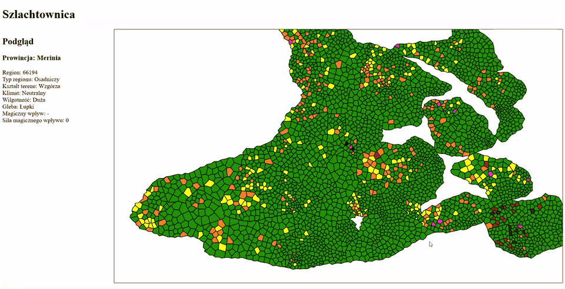

# Szlachtownica

Backend symulacji świata w autorskim settingu (notatki w `lore/`).

Docelowo ma symulować pełną historię rozwoju królestwa (osadnictwo, handel, wojny) oraz szlachty (genealogia, powstawanie i wymieranie rodów, osobiste ambicje i zdrady).

Obecnie generuje geografię świata. Prowincje mają odgórnie zadane granice, a na podprowincje i regiony dzieli je diagram Voronoi. Każdy region dostaje konfigurację (klimat, wilgotność, ukształtowanie terenu, zalesienie), na której mają się później opierać osadnictwo i handel.



Nazwy miejsc i postaci w kilku sztucznych językach powstają z reguł fonotaktyki i morfologii. Gotowe są `ErnizjumPhonotactic` i `NerenethPhonotactic`, reszta to na razie stuby. Nazwy ludowe generuje osobno `VillageNameGenerator`.

Część szlachecka zeszła na razie na dalszy plan i nie jest aktywnie rozwijana.

## Stack

- Java 17, Spring Boot 3.2 (Web, Data JPA), Maven
- PostgreSQL + PostGIS, Hibernate Spatial
- JTS i GeoTools: operacje na geometrii, przeliczanie układów współrzędnych
- jts2geojson: geometrie w odpowiedziach API jako GeoJSON
- Frontend (Angular): [szlachtownica-frontend](https://github.com/mfurmane/szlachtownica-frontend)

## Uruchomienie lokalne

Wymagania: JDK 17+, Maven, PostgreSQL z PostGIS.

1. Baza `szlachtownica` na `localhost:5432`, użytkownik i hasło `postgres`/`postgres` (patrz `src/main/resources/application.properties`).

2. Schemat zakłada Flyway przy starcie aplikacji (migracje w `src/main/resources/db/migration/`). Jeśli baza ma już tabele założone wcześniej ręcznie, pierwszy start trzeba zrobić z `--spring.flyway.baseline-on-migrate=true`.

3. Uruchomienie: klasa `priv.mfurmane.szlachtownica.App` z IDE albo z wiersza poleceń:

   ```
   mvn spring-boot:run
   ```

   Katalogiem roboczym musi być katalog główny repo, bo kod czyta kontury z `src/main/resources/` ścieżkami względnymi. `mvn spring-boot:run` i domyślna konfiguracja IntelliJ tak właśnie ustawiają.

### Co się dzieje przy starcie

`MainEngine` generuje świat od nowa: wczytuje kontury, dzieli prowincje na podprowincje i regiony (Voronoi) i zapisuje je do bazy.

### API

Port 8080, CORS otwarty dla `http://localhost:4200` (serwer deweloperski Angulara).

- `GET /world/provinces/all`: prowincje z podprowincjami i regionami, geometrie w GeoJSON.

## Dane

- `src/main/resources/`: kontury prowincji, rzek, jezior i gór w plikach `.points`. Są to współrzędne pikselowe z mapy, przeliczane na lon/lat (EPSG:4326).
- `lore/`: notatki o świecie (Markdown, arkusze ODS).

## Status

Projekt hobbystyczny w aktywnym rozwoju. Część modułów jest niedokończona albo zakomentowana, między innymi zdarzenia w czasie i bezpieczeństwo/JWT. Testów na razie nie ma. Frontend w Angularze jest na razie bardzo szczątkowy.
